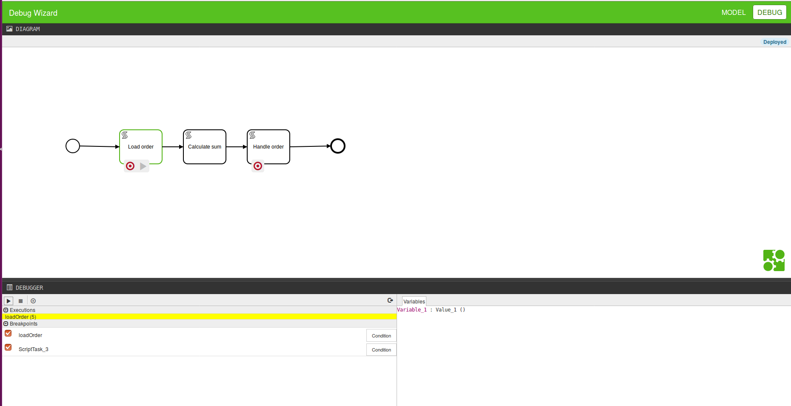

# Wizard

Debug Wizard for tracking bpmn processes. Based on [camunda-bpm-workbench](https://github.com/camunda/camunda-bpm-workbench). 



## Components

The app provides a BPMN modeler and debugger. These allow you to design BPMN 2.0 processes and interactively explore their execution.


### BPMN Modeler

The BPMN renderer embeds [bpmn.io][bpmnio] rendering BPMN 2.0 XML files directly inside the browser.
You can simply drop a BPMN file from your desktop and have it rendered inside the Browser.

### Debugger

The debugger connects to runtime (a middleware between web interface and process engine) using a Websocket.
You can put breakpoints directly inside the process diagram and inspect the current state of the process variables.


## Setup and Run


Install client dependencies:

```
(cd webapp/ && npm install && bower install)
```

Build and start backend on `localhost:9090`:

```
(cd api/debug-service-websocket && mvn exec:java -P develop)
```

Build client (web interface) and start it on `localhost:9000`

```
(cd webapp/ && grunt auto-build)
```

Open [http://localhost:9000](http://localhost:9000) in your browser.
